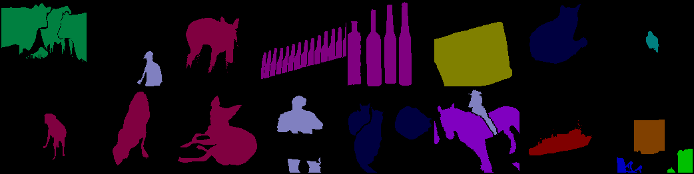

# diffusion_segmentation
Use de-noising diffusion model to segment the objects on the image step by step.
Currently, in experimentation and training process.

[Model checkpoints to download](https://drive.google.com/drive/folders/18pPK4EkeSxQ2-VMhLBbJQ37S8FOVI4DY?usp=sharing)

### Output from ongoing experiment:

